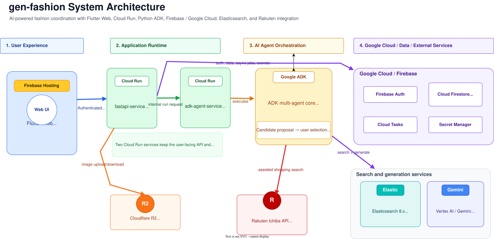
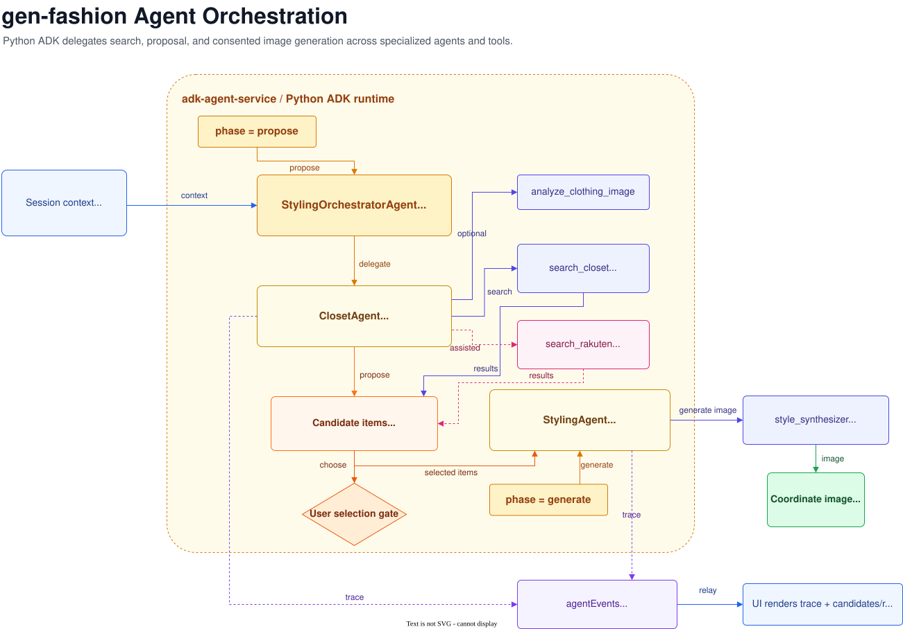

# Gen Fashion

[日本語版](README-ja.md)

Gen Fashion is an AI-assisted fashion coordination service. Users build a
digital wardrobe from their own clothing photos, review outfit candidates
proposed by AI agents, and generate a final styled image from the items they
explicitly approve. The app also includes an assisted-shopping flow that starts
from the user's wardrobe and searches Rakuten for complementary items.

Live demo: https://gen-fashion-app.web.app



## Product Flow

The main workflow is intentionally user-controlled:

1. Sign in with Firebase Authentication.
2. Upload clothing photos into a personal closet.
3. Analyze each item with Gemini and store searchable metadata in Firestore and
   Elasticsearch.
4. Start a styling session from personal closet items, shared demo-closet items,
   or assisted mode.
5. Stream ADK agent activity to the Flutter Accordion UI over SSE while agents
   search for candidate items.
6. Pause at the candidate-selection gate until the user approves the items.
7. Generate the final outfit image with Nano Banana and persist the session in
   history.

The selection gate is part of the domain model, not just a UI detail. The system
does not generate a final outfit image until the user has approved the candidate
items.

## Architecture

The repository is organized around a ports-and-adapters structure. The
user-facing API, long-running agent execution, storage adapters, and external
service integrations are separated so each part can be tested and deployed
independently.

- `flutter-web-app/`: Flutter Web client for authentication, closet management,
  styling sessions, history, shared closets, and assisted coordinate mode.
- `fastapi-service/`: REST API, session orchestration, closet use cases, signed
  upload/download URLs, Cloud Tasks worker routes, and Firestore /
  Elasticsearch / R2 adapters.
- `adk-agent-service/`: Python Google ADK runtime with orchestration agents,
  ClosetAgent, StylingAgent, Rakuten search, image-generation tooling, and event
  persistence.
- `scripts/seed_shared_closet/`: seed pipeline for shared demo closets across
  Firestore, Elasticsearch, and R2/MinIO.
- `scripts/deploy/`: deployment helpers for Cloud Run, Firebase Hosting,
  Firestore indexes, and teardown.

The detailed architecture record is maintained in
[docs/architecture-overview.md](docs/architecture-overview.md). The README uses
the two Draw.io-exported SVG diagrams kept in this repository:
[system-architecture.svg](docs/assets/system-architecture.svg) and
[agent-flow.svg](docs/assets/agent-flow.svg).

### Agent Orchestration

The agent flow separates proposal from generation. Search and recommendation
tools run first, the session pauses for user selection, and image generation
runs only with approved items.



## Technology Stack

| Area | Technology | Role |
|---|---|---|
| Frontend | Flutter Web, Dart | Authenticated web UI, closet management, styling flow |
| Auth / Hosting | Firebase Authentication, Firebase Hosting | Sign-in and web delivery |
| API | Python 3.11, FastAPI, Pydantic | REST API, use cases, adapters |
| Agent runtime | Google ADK, google-genai | Multi-agent orchestration and tool calls |
| AI models | Gemini, Nano Banana | Image analysis, embeddings, outfit image generation |
| Search | Elasticsearch 8.x | Keyword + vector hybrid search for clothing items |
| Database | Cloud Firestore | Users, closet metadata, sessions, agent events |
| Object storage | Cloudflare R2, MinIO locally | Clothing photos and generated images |
| Async work | Cloud Tasks, local HTTP queue | Background analysis after upload |
| External API | Rakuten Ichiba API | Assisted-shopping suggestions |
| Infrastructure | Cloud Run, Compute Engine, Secret Manager | Production runtime and secret management |
| CI/CD | GitHub Actions, Workload Identity Federation | Test gate and production deploy workflow |
| Local dev | Docker Compose, Firebase emulators, MinIO | Reproducible local stack |

## Production Runtime

Production is served by Firebase Hosting and two Cloud Run services.

- `fastapi-service` is the public API. Firebase-authenticated routes serve the
  web client, while internal worker routes are protected separately.
- `adk-agent-service` is a private service invoked by FastAPI for agent runs.

State and media are split by responsibility:

- Firestore stores closet metadata, session state, proposed candidates, selected
  items, generated results, and agent events.
- Elasticsearch runs on a Compute Engine VM without an external IP. Cloud Run
  reaches it through Direct VPC egress and restricted firewall rules.
- Cloudflare R2 stores uploaded garment photos and generated coordinate images.
- Secret Manager and GitHub Actions secrets hold production credentials.

Operational commands are collected in
[docs/gcp-cheatsheet.md](docs/gcp-cheatsheet.md). During the public demo window,
the Elasticsearch VM night-stop schedule is detached until 2026-08-31 so the
service remains available throughout the day.

## Local Development

Start the full local stack:

```bash
cp .env.example .env
make dev
make web
```

Main local services:

- FastAPI: `localhost:8000`
- ADK agent service: `localhost:3000`
- Elasticsearch: `localhost:9200`
- Firestore emulator: `localhost:8080`
- Firebase Auth emulator: `localhost:9099`
- MinIO: `localhost:9000` / console `localhost:9001`
- Flutter Web: `localhost:8088`

See [README_LOCAL_DEV.md](README_LOCAL_DEV.md) for setup details, emulator
behavior, seed data, and troubleshooting.

## Verification

Common checks:

```bash
# Backend tests
cd fastapi-service && pytest -q

# Agent service tests
cd adk-agent-service && pytest -q

# Flutter checks
cd flutter-web-app && flutter analyze && flutter test

# Firestore security rules
cd firebase && npm install && firebase emulators:exec --only firestore --project gen-fashion-local "npm test"
```

The CI/CD workflow is defined with FastAPI tests, ADK tests, Flutter
analyze/test, and deployment-script tests. Its production deploy job is wired to
build both service images, deploy Cloud Run, deploy Firestore indexes, build
Flutter Web, deploy Firebase Hosting, and finish with a post-deploy smoke check.
The latest audited `main` workflow run completed successfully. The remaining
CI/CD work is tracked in MF-5 and MF-6: authenticated coordination smoke in CI,
plus a dedicated pipeline runbook.

## Engineering Notes

Project decisions and implementation status are tracked as code:

- [docs/feature-matrix-phase01.md](docs/feature-matrix-phase01.md): Phase 1
  requirements and status.
- [docs/feature-matrix-phase02.md](docs/feature-matrix-phase02.md): Phase 2
  requirements and status.
- [docs/architecture-overview.md](docs/architecture-overview.md): system
  architecture and implemented/planned boundaries.
- [docs/plans/](docs/plans): ExecPlans for larger features, deployment, and
  hardening work.
- [CONTRIBUTING.md](CONTRIBUTING.md): branch model, PR flow, and CI
  expectations.

Changes are kept close to use-case boundaries, with regression coverage around
failure-prone infrastructure paths such as Cloud Tasks, Firestore access,
Elasticsearch mappings, and frontend session recovery.

## Repository Map

| Path | Purpose |
|---|---|
| `flutter-web-app/` | Flutter Web client |
| `fastapi-service/` | Public API and application use cases |
| `adk-agent-service/` | Google ADK agent runtime and tools |
| `firebase/` | Firebase emulator and security rules tests |
| `scripts/deploy/` | Deployment and teardown helpers |
| `scripts/seed_shared_closet/` | Shared closet dataset seeding |
| `docs/` | Requirements, architecture, plans, operations |
| `poc/` | AI and connectivity proof-of-concept scripts |

## License

No open-source license has been selected for this repository. The source code
and project documentation are currently [all rights reserved](LICENSE), unless a
file or directory states otherwise.

Third-party datasets, sample inputs, generated media, and external service
assets are not relicensed by this repository. The shared demo closet seed uses
Alexey Grigorev's Clothing Dataset under CC BY-SA 4.0; see
[the seed script README](scripts/seed_shared_closet/README.md) for attribution.

External submissions may use different terms. The ProtoPedia submission for
this project is licensed on ProtoPedia under Creative Commons Attribution CC BY
4.0 or later; that applies to the submitted ProtoPedia materials, not to this
repository's source code.
