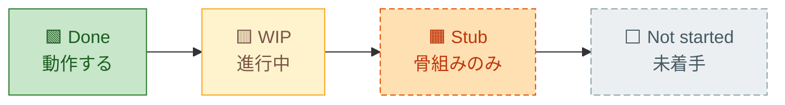
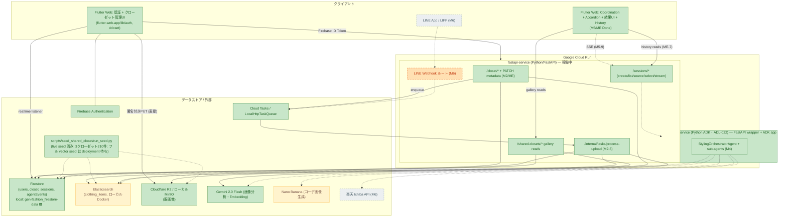
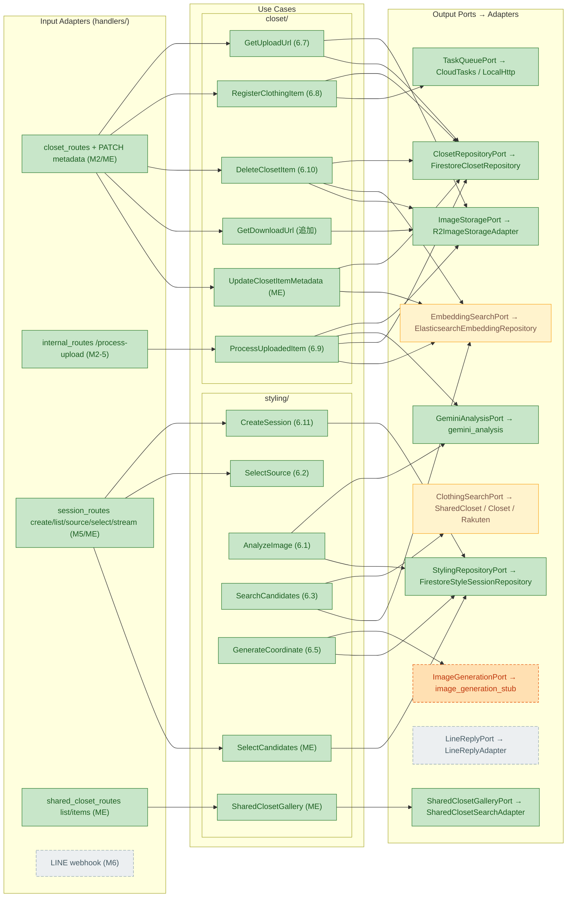
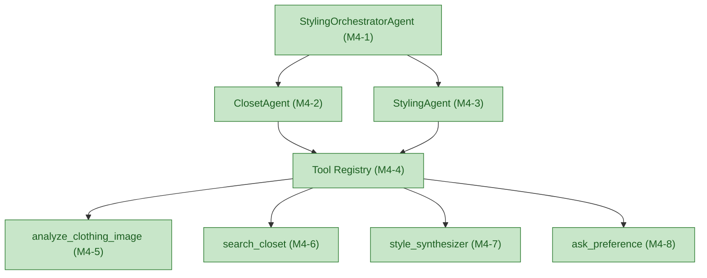
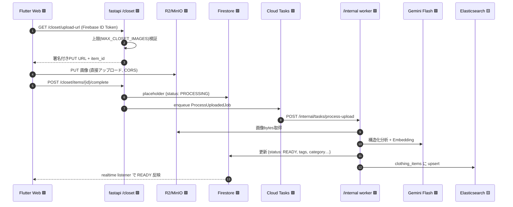
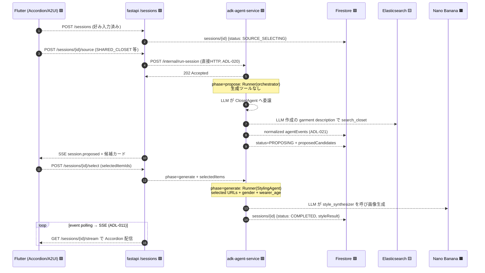
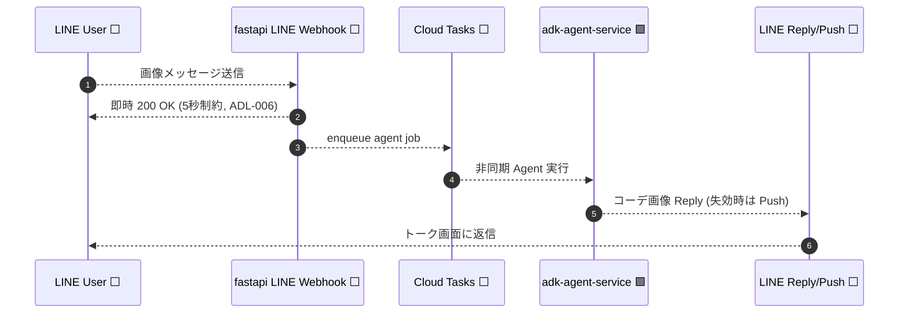
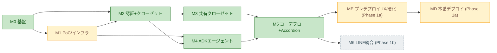

# Architecture Overview — gen-fashion (Phase 1)

> **ME completion sync (2026-06-24):** ME-1…ME-7 are implemented and locally
> verified. The diagrams below include the two-phase candidate-selection gate,
> gender/child context, shared-gallery reads, owner metadata editing, and the
> owner-scoped completed-run History gallery. MD is unblocked to resume.
>
> **Agent-flow recovery (2026-06-21):** Production `/internal/run-session` again
> runs real ADK agents. Propose uses the orchestrator/ClosetAgent tree with
> generation physically withheld; after selection, generate runs StylingAgent
> with `style_synthesizer`. Adult/child primary-agent smokes and rendered browser
> E2E passed; the former fixed Python production driver is fallback-only.
>
> **Local shared-data durability (2026-06-24):** Firestore emulator state is
> snapshotted to the named `gen-fashion_firestore-data` volume and imported on
> startup. The shared seed now contains 3×70 items; container recreation restored
> all 3 metadata docs and 210 item docs without reseeding.

> **生成日:** 2026-06-08
> **最終同期:** 2026-06-21 — **デプロイ前ローカル実機検証で実バグ3件を発見・修正**（`docs/plans/20260621-md-phase1a-local-verification-checklist.md`）。(1) 内部 worker base-URL 混在が `make dev` でも実害（アップロード→READY が常時 404）→ MD-8 の base-URL 分離ローカル分を先行着手（`FASTAPI_INTERNAL_BASE_URL`）。(2) Firestore がバックエンドの Vertex プロジェクト（`animation-agent`）にバインドされフロント/Auth（`gen-fashion-local`）と名前空間分離 → `firestore_project_id`（Firebase プロジェクト）へ修正。(3) `closetId` が動的 `text` 化で SHARED_CLOSET 検索 0 件 → M2-9 マッピングに keyword 宣言を追加し再シード。修正後、fastapi pytest 59 / adk pytest 28 / flutter clean、M5 コーデ smoke + ブラウザ E2E が `COMPLETED` + **実 Nano Banana 画像**（§8 #2–#4 参照）。同日是正: 埋め込みを `gemini-embedding-001`＋**テキスト埋め込み**（インデックスもクエリも同一空間）に修正し、`--with-embeddings` で 90×768次元 + kNN 意味検索を確認（MD-10 de-risk）。ADK タイムアウトを config 化（45→90）し SSE 上限を 150 に整合 → 主LLM経路で COMPLETED。Prior: 2026-06-15 — **MD（Phase 1a Production Deployment & Hardening）起票**（`docs/plans/20260615-md-phase1a-production-deployment.md`、MD-1…MD-14 🟡 In progress）。ローカル検証済みの Phase 1a スタックを Google Cloud へデプロイする計画: Compute Engine ES + Serverless VPC Access connector（ADL-023、M1-3 完了）、フル vector seed（`--with-embeddings`、M3-2）、Cloud Run ×2 + Secret Manager + OIDC（ADL-024、M2-5 ゲート）、Vertex AI 上の Nano Banana 実生成（M4-7/M5-6）、Firebase Hosting（ADL-025）。計画中に判明した配線課題: `ADK_INTERNAL_BASE_URL` が run-session と process-upload で混在（worker ルートは `fastapi-service` 実装だが adapter は ADK URL を参照）→ MD-8 で `FASTAPI_INTERNAL_BASE_URL` を分離。**M6（LINE, Phase 1b）には着手しない。** Prior: 2026-06-14 — M5 完了（`docs/plans/20260612-m5-coordination-flow-accordion-ui.md`）。FastAPI `/sessions`、ADK `/internal/run-session`、`agentEvents` 書き込み、SSE polling stream、Flutter Coordination/Accordion UI は実装済み。review hardening として final SSE drain、cursor event reads、ADK trigger failure compensation、ADK internal-secret guard、selected shared-closet filtering、ADK status sequencing を追加済み。local Docker/API smoke と rendered Flutter Web browser E2E は authenticated `SHARED_CLOSET` session → Accordion event evidence → `COMPLETED` result image まで通過。
> **ベース:** [req-phase01.md](req-phase01.md)（仕様の source of truth）・[feature-matrix-phase01.md](feature-matrix-phase01.md)（実装状況）
> **目的:** アーキテクチャ／システム構成を可視化し、**既に実装済みのコード**と**これから実装予定のコード**の境界を明確に強調する。

---

## 凡例 (Legend)

このドキュメントの全図は、コードの**実在状態**で色分けする。「ファイルが存在する」ことと「動作する」ことを区別する点が要点。

| 表記 | 意味 | コードの状態 |
|---|---|---|
| 🟩 **Done** | E2E で動作する実装済み機能 | 実装あり・検証済み |
| 🟨 **WIP** | 進行中／一部のみ確定 | 局所的に実装、残りは保留 |
| 🟧 **Stub**（橙・破線） | **スケルトンのみ**。ファイルは存在するが `NotImplementedError` / `throw Error("Implement in M…")` / `501` を返す | **これから実装予定** |
| ⬜ **Not started**（灰・破線） | コードが存在しない | **これから実装予定** |

> **🟧 Stub と ⬜ Not started はどちらも「これから実装予定」**である。違いは、M0 で骨組み（ポート IF・空のユースケース・空のエージェント）まで先行配置済みか否か。M5 は session/ADK/SSE/Flutter UI と rendered browser E2E まで完了、Phase 1b（M6・LINE）は ⬜ 未着手。M3 は local で実装完了（フル vector seed のみ deployment 待ち）。M4 は Python ADK で実装完了（ローカル ADK Web UI / api_server で稼働）。

---

## マイルストーン別 実装サマリ

| Milestone | 内容 | Phase | 状態 |
|---|---|---|---|
| **M0** | プロジェクト基盤・ローカル開発環境 | 1a | 🟩 **Done** |
| **M1** | PoC & インフラ検証（画像生成・ADK イベント・ES） | 1a | 🟩 Done（M1-3 ES の GCE デプロイ部分のみ 🟨 WIP） |
| **M2** | 認証 & クローゼット管理（Web） | 1a | 🟩 **Done**（E2E 検証済み） |
| **M3** | 共有デモクローゼット | 1a | 🟩 **Done（local）**（seed script / SharedClosetSearchAdapter / attribution UI 実装済み。既存150件を保持してトップス/ボトムス60件を追加し、3クローゼットを210件・70/70/70でlive seed済み。Firestore emulatorはnamed volume `gen-fashion_firestore-data`からimport/exportし、コンテナ再作成後も再seedなしで復元確認済み 2026-06-24。フル vector seed（GCE ES）のみ deployment 待ち） |
| **M4** | ADK エージェント中核 | 1a | 🟩 **Done（local）**（2026-06-11: Python ADK 再構築完了（ADL-022・TS 骨組み削除）。orchestrator + 2 sub-agents + 4 tools が `adk api_server`/Web UI でローカル稼働、M3 シード済み `SHARED_CLOSET` に対する委譲 → `search_closet`（attribution 付き）→ `style_synthesizer`（collage fallback）E2E 確認、pytest 17 passed。Nano Banana 生成パスは free-tier quota の都合で fallback のみ実証） |
| **M5** | コーディネートフロー & Accordion UI | 1a | 🟩 **Done**（FastAPI session routes/repository/use cases、ADK run endpoint/event writer、SSE polling stream、Flutter Coordination/Accordion UI 実装済み。local API/SSE smoke と rendered browser E2E は `COMPLETED` まで検証済み） |
| **ME** | Pre-Deployment Experience & Domain Hardening | 1a | 🟩 **Done**（ME-1…ME-7 実装・ローカル検証完了。性別/child 伝播、必須候補選択ゲート、トレース/結果分離、共有/履歴ギャラリー、自分のメタデータ編集。履歴の weather / duplication 拡張は将来。） |
| **MD** | Phase 1a Production Deployment & Hardening | 1a | 🟨 **WIP（ME gate closed; resume next）**（`docs/plans/20260615-md-phase1a-production-deployment.md`、MD-1…MD-14 🟡。GCE ES + VPC connector、フル vector seed、Cloud Run ×2、Secret Manager + OIDC、Vertex AI Nano Banana、Firebase Hosting。） |
| **MF** | CI/CD（Continuous Delivery） | 1a | ⬜ **Planned（tracking only, no ExecPlan yet）**（MF-1…MF-6。GitHub Actions + Workload Identity Federation で MD の手動デプロイを自動化: CI ゲート（per-service tests + image build）+ CD（Artifact Registry → Cloud Run ×2 + Firebase Hosting）+ デプロイ後スモーク/ロールバック。req §19 / ADL-030–032。**MD 依存**、ExecPlan は MD 完了後。） |
| **M6** | LINE チャネル統合 | 1b | ⬜ **Not started**（ファイル無し） |

**現在地:** Phase 1a は **ME（ME-1…ME-7）までローカル検証完了**。ME-3/ME-6 の must-fix は閉じ、次は **MD（本番デプロイ）を再開**する。MD 完了後に **MF（CI/CD）** を別 ExecPlan として起票し、MD の手動デプロイを GitHub Actions + WIF で自動化する（req §19、追跡のみ）。履歴の weather / duplication 拡張は将来。Phase 1b の LINE / LIFF / Rakuten（M6）には着手しない。

**ME 実装追加（implemented and locally verified）:**
- **入力アダプタ（routes）:** `POST /sessions/{id}/select`（候補確定 → generate フェーズ起動）、`GET /sessions`（認証ユーザーの完了履歴、`completedAt` 降順）、`GET /shared-closets` ＋ `GET /shared-closets/{closetId}/items`（共有クローゼット閲覧、読み取り専用・バックエンド経由）、`PATCH /closet/items/{id}`（自分のアイテムの検索用メタデータ編集、ADL-028）。
- **ユースケース:** `SelectCandidatesUseCase`、`ListSharedClosets`/`ListSharedClosetItems`、`UpdateClosetItemMetadataUseCase`。
- **状態 / イベント:** `sessions/{id}.proposedCandidates`（新フィールド）、SSE `session.proposed`（`PROPOSING` 一時停止で候補を配信）、`selectedItems` が生成ゲートの必須入力に昇格。`ADK /internal/run-session` に `phase`（propose / generate）＋ `selectedItems` を追加し **2回の ADK agent 実行**へ分割（propose の agent tree から `style_synthesizer` を除外して req §3「同意なき自動生成禁止」を構造的に担保）。
- **データプレーン:** `gender`（keyword）を ES `clothing_items` と Firestore `users/{uid}/closet/{itemId}` / `shared_closet/{itemId}` / セッションの `userPreference` に追加。共有はシード時ヒューリスティック付与、個人は分析時付与＋ギャラリー編集（ADL-026/ADL-028）。生成プロンプトに着用者の性別・年代（adult/child）を渡す（ADL-026）。

---

## 1. システム構成図（コンテナ / デプロイ）

req §9.1 の 2 コンテナ構成を、外部サービス・データストアと合わせて示す。色は各要素の現状。

**読み取りポイント:**
- 🟩 **動く経路**: Flutter（認証＋クローゼット）→ fastapi `/closet` → R2 / Firestore / Cloud Tasks → `/internal` worker → Gemini 分析 + ES インデックス。これが M2 で E2E 検証済みの幹線。
- 🟩 **共有クローゼット**: seed script / shared search adapter / attribution UI は実装済み。ローカルは210件（70/70/70）をlive seedし、Firestore volumeからのコンテナ再作成復元も確認済み。GCE ES への full vector seedのみ未完了。
- 🟩 **エージェント中核（M4）**: `adk-agent-service` は Python ADK で実装済み・ローカル稼働（`adk web` / `adk api_server`、コンテナも healthy）。`search_closet` は ES の実データ（M3 シード含む）を返し、`style_synthesizer` は MinIO/R2 に結果画像を保存する。ADK が自前で発行した署名付き MinIO/R2 URL は内部 storage key として再取得できるため、Compose コンテナ内でも `localhost:9000` URL に依存しない。
- 🟩 **Nano Banana 画像生成**: `style_synthesizer` の生成呼び出しは実装済み。**2026-06-21 のローカル検証で Vertex AI（SA = プロジェクト `animation-agent`）の `gemini-2.5-flash-image` で実生成を確認**（コーデ画像 ~1.15 MB、`modelUsed=gemini-2.5-flash-image`、collage fallback ではない）。以前の「ローカルは free-tier quota の都合で collage のみ」という制約は解消。本番（MD-11）はモデル可用リージョン + 課金で再確認する。
- 🟩 **M5 Done**: `/sessions/*`、ADK `/internal/run-session`、`agentEvents` 書き込み、SSE、Accordion UI は実装済み。review hardening で SSE terminal race、orphaned `SEARCHING`、unbounded stream、unprotected ADK internal route、shared-closet picker filtering、ADK/FastAPI status-sequence mismatch を修正済み。local API/SSE smoke と rendered browser E2E は authenticated `SHARED_CLOSET` session → `COMPLETED` result まで通過。
- ⬜ **未着手**: LINE / LIFF / 楽天。
- 🟨 ES はローカル Docker では動作。GCE VM + VPC + Cloud Run プライベート接続はデプロイ期に延期（M1-3）。

---

## 2. ヘキサゴナル ポート & アダプタ マップ

req §5 / §6 の Ports & Adapters を、実コードの状態で塗り分けたもの。**橙破線＝骨組み（実装予定）**が一目で分かる。

> `ClothingSearchPort`(p7) は `SharedClosetSearchAdapter` が実装済み（署名付き共有画像 URL + attribution 返却）だが、`ClosetSearchAdapter` / `RakutenItemAdapter` は未作成（⬜）のため全体としては 🟨。`EmbeddingSearchPort`(p2) はキーワード検索まで実装済みだがベクトル/ハイブリッド検索の本番運用は ES デプロイ（M1-3）待ちで 🟨。

---

## 3. ADK エージェント構成（M4 — 🟩 実装済み・ローカル稼働）

req §7.1 のエージェントトポロジ。M4 ExecPlan（`docs/plans/20260609-m4-adk-agents-core.md`）で TS 骨組みを破棄し、**Python ADK（`google-adk` 2.1.0）** の `adk-agent-service/styling_app/` として実装完了（ADL-022、2026-06-11）。`adk web` / `adk api_server` が `styling_app` を `root_agent`（orchestrator）として公開し、各ツールは Tool Registry 経由でサブエージェントに配線される。本番では同じ factory から propose 用 root（生成ツールなし）と generate 用 StylingAgent（生成ツールあり）を構築し、両方を `runner.run_async` で実行する。

---

## 4. フロー図① — クローゼット画像アップロード（🟩 M2: 実装済み・動作する）

req §6.7–6.9 / §8.4 / ADL-014。M2 で E2E 検証済みの実フロー。

---

## 5. フロー図② — コーディネート提案（🟩 ME 選択ゲートまで Done）

req §6.1–6.5 / ADL-011 / ADL-020 / ADL-021 / ADL-027。アプリの
`/internal/run-session` は、人間の選択を境に2回の実 ADK run を起動する。
propose は orchestrator → ClosetAgent の委譲と LLM が作った検索文で候補を
集めるが、agent tree に生成ツールがない。generate は選択後に StylingAgent
を起動し、選択済み URL・gender・wearer_age で画像を生成する。各 ADK event
は `normalize_adk_event` から Firestore に保存される。固定 Python 検索/生成は
各 phase が結果を返せなかった場合だけの保険である。

---

## 6. フロー図③ — LINE チャネル（⬜ M6: 未着手 / Phase 1b）

req §1 Phase 1b / §7.4 / §10.2 / ADL-006。**ファイル自体が存在しない**。M5 完了後の次フェーズとして着手する（req §14）。

---

## 7. 実装ロードマップ（依存関係）

**次の一手:** ME-1…ME-7 と must-fix（ME-3/ME-6）は完了したため、**MD（`docs/plans/20260615-md-phase1a-production-deployment.md`）を再開する**。履歴の weather / duplication 拡張と M6（LINE / LIFF / Rakuten, Phase 1b）には着手しない。

---

## 8. 実装と要件の乖離メモ（可視化中に検出）

図と実コードを突き合わせる過程で、req と実装の不一致を検出した。#1 は M4 ExecPlan 起票時に解消済み。#2 は配線本番修正のローカル分が 2026-06-21 に着手済み（クラウド分は MD-8）。#3・#4 は 2026-06-21 のローカル実機検証で発見・修正した実バグ（詳細: `docs/plans/20260621-md-phase1a-local-verification-checklist.md`）。

1. ~~**`adk-agent-service` の言語スタック**~~ — **解消済み（2026-06-09, ADL-022）**: **Python ADK に統一**する決定を `req-phase01.md` ADL-022 に記録。現状の TS 骨組み（`src/*.ts`）は M4 ExecPlan（`docs/plans/20260609-m4-adk-agents-core.md`）で破棄・置換する。根拠は req §2/§6/§7、M1-4 の Python `runner.run_async()` PoC、ADL-021 の共有 `FirestoreStyleSessionRepository`、および既存 Python アダプタの再利用。

2. **`process-upload` worker の配置 + 内部 base URL の混在**: req §6.9 / §9.1 は当該 worker を `adk-agent-service` 配置と記述。実装は **`fastapi-service` の `/internal/tasks/process-upload`**（feature-matrix M2-5 も fastapi-service と明記）。**MD 起票時（2026-06-15）の追加発見:** `fastapi-service` の task adapter（`cloud_tasks_adapter.py` / `local_task_queue.py`）はこの worker URL を `ADK_INTERNAL_BASE_URL` から組み立てているが、同 var は run-session（ADK サービス向け、`adk_agent_run.py`）にも使われ **混在**している。ローカルでは worker タスクが ADK サービス（:3000、当該ルート無し）に向くため、本番ではミスルートする。**MD-8 で `FASTAPI_INTERNAL_BASE_URL` を分離して解消**（worker タスクは fastapi 自身の URL を、run-session は ADK URL を指す）。**2026-06-21 のローカル検証で、これは本番だけでなく `make dev` でも実害**（アップロード→READY が常時 404）と判明したため、**base-URL 分離のローカル分を先行着手**（`config.py` の `fastapi_internal_base_url` + `local_task_queue.py` + compose の `FASTAPI_INTERNAL_BASE_URL`）。OIDC / Cloud Tasks audience 等のクラウド分は引き続き MD-8。req のコンテナ責務記述との不一致自体は引き続き申し送り。

3. **Firestore データプロジェクトの取り違え**（2026-06-21 発見・修正）: 両サービスの Firestore クライアントが Vertex 用 `GOOGLE_CLOUD_PROJECT`（ローカルは `animation-agent`）でバインドしており、フロント/Auth の `gen-fashion-local` とエミュレータ名前空間が分離 → UI がクローゼット/セッションを参照できなかった。`firestore_project_id`（= Firebase プロジェクト）を両 config に追加し 3 つの firestore アダプタへ適用、adk compose に `FIREBASE_PROJECT_ID` を追加。本番は全プロジェクト同一のため no-op。

4. **`clothing_items` の `closetId` が動的 `text` マッピング**（2026-06-21 発見・修正）: `fastapi-service` の `ensure_index`（M2-9 正規マッピング）が `closetId`/`closetKind`/`imageUrl` を宣言しておらず、fastapi が seed より先にインデックスを作るため動的 `text` 化 → SHARED_CLOSET の `closetId` term フィルタが 0 件 → コーディネーションが `ERROR`。当該 3 フィールドを keyword で明示宣言（seed マッピングと整合）、reindex + 再シードで解消。

> #2–#4 は feature-matrix の status と矛盾しない（実装行は引き続き ✅）。本メモはドキュメント整合と再発防止のための申し送りで、#2 のクラウド配線本番修正は MD-8 が担当する。
