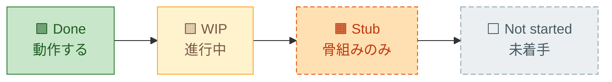
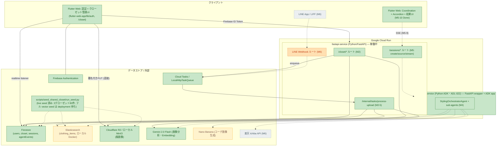
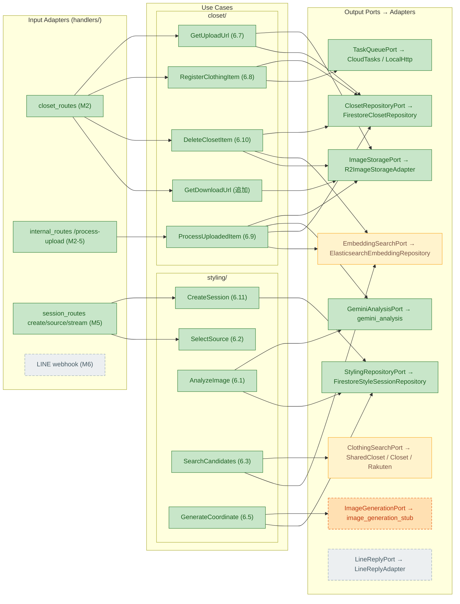
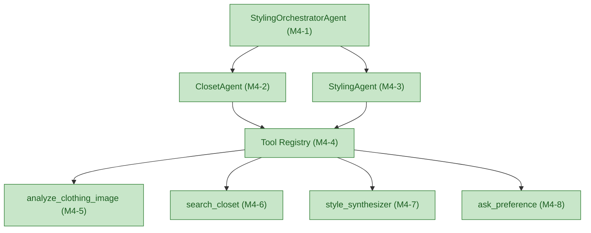
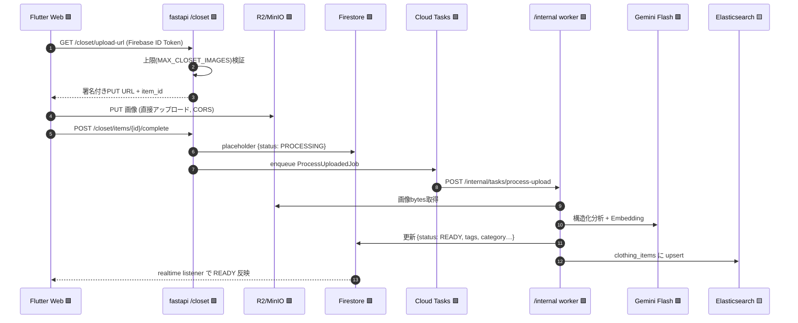
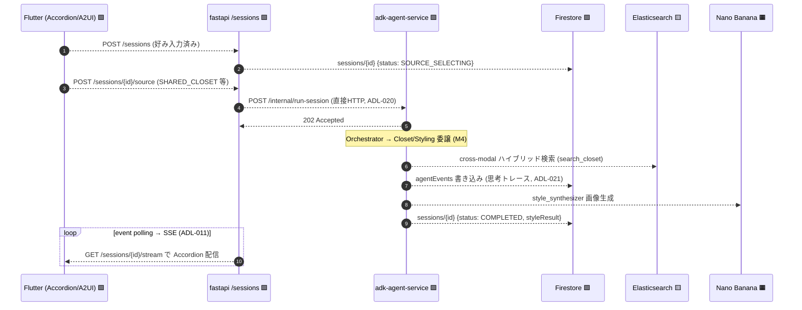
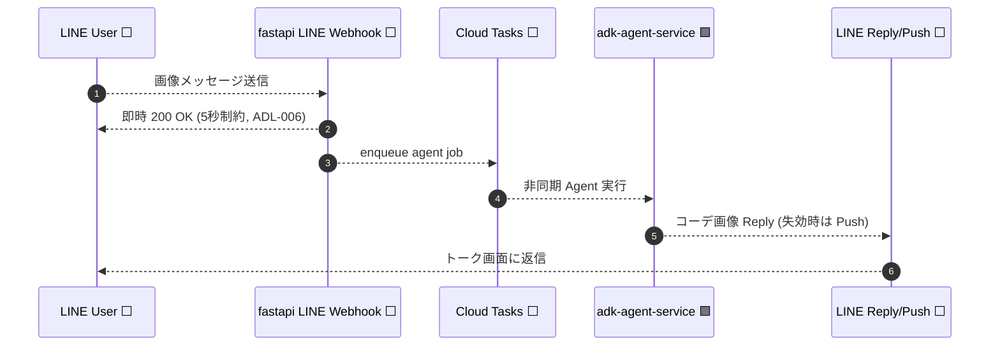
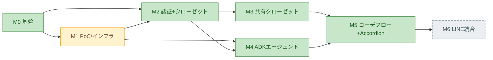

# Architecture Overview — gen-fashion (Phase 1)

> **生成日:** 2026-06-08
> **最終同期:** 2026-06-14 — M5 完了（`docs/plans/20260612-m5-coordination-flow-accordion-ui.md`）。FastAPI `/sessions`、ADK `/internal/run-session`、`agentEvents` 書き込み、SSE polling stream、Flutter Coordination/Accordion UI は実装済み。review hardening として final SSE drain、cursor event reads、ADK trigger failure compensation、ADK internal-secret guard、selected shared-closet filtering、ADK status sequencing を追加済み。local Docker/API smoke と rendered Flutter Web browser E2E は authenticated `SHARED_CLOSET` session → Accordion event evidence → `COMPLETED` result image まで通過。
> **ベース:** [req-phase01.md](req-phase01.md)（仕様の source of truth）・[feature-matrix-phase01.md](feature-matrix-phase01.md)（実装状況）
> **目的:** アーキテクチャ／システム構成を可視化し、**既に実装済みのコード**と**これから実装予定のコード**の境界を明確に強調する。

---

## 凡例 (Legend)

このドキュメントの全図は、コードの**実在状態**で色分けする。「ファイルが存在する」ことと「動作する」ことを区別する点が要点。

| 表記 | 意味 | コードの状態 |
|---|---|---|
| 🟩 **Done** | E2E で動作する実装済み機能 | 実装あり・検証済み |
| 🟨 **WIP** | 進行中／一部のみ確定 | 局所的に実装、残りは保留 |
| 🟧 **Stub**（橙・破線） | **スケルトンのみ**。ファイルは存在するが `NotImplementedError` / `throw Error("Implement in M…")` / `501` を返す | **これから実装予定** |
| ⬜ **Not started**（灰・破線） | コードが存在しない | **これから実装予定** |

> **🟧 Stub と ⬜ Not started はどちらも「これから実装予定」**である。違いは、M0 で骨組み（ポート IF・空のユースケース・空のエージェント）まで先行配置済みか否か。M5 は session/ADK/SSE/Flutter UI と rendered browser E2E まで完了、Phase 1b（M6・LINE）は ⬜ 未着手。M3 は local で実装完了（フル vector seed のみ deployment 待ち）。M4 は Python ADK で実装完了（ローカル ADK Web UI / api_server で稼働）。

---

## マイルストーン別 実装サマリ

| Milestone | 内容 | Phase | 状態 |
|---|---|---|---|
| **M0** | プロジェクト基盤・ローカル開発環境 | 1a | 🟩 **Done** |
| **M1** | PoC & インフラ検証（画像生成・ADK イベント・ES） | 1a | 🟩 Done（M1-3 ES の GCE デプロイ部分のみ 🟨 WIP） |
| **M2** | 認証 & クローゼット管理（Web） | 1a | 🟩 **Done**（E2E 検証済み） |
| **M3** | 共有デモクローゼット | 1a | 🟩 **Done（local）**（seed script / SharedClosetSearchAdapter / attribution UI 実装済み。3クローゼットの live seed 済み＝90件・30/30/30・冪等性検証済み 2026-06-10。フル vector seed（GCE ES）のみ deployment 待ち） |
| **M4** | ADK エージェント中核 | 1a | 🟩 **Done（local）**（2026-06-11: Python ADK 再構築完了（ADL-022・TS 骨組み削除）。orchestrator + 2 sub-agents + 4 tools が `adk api_server`/Web UI でローカル稼働、M3 シード済み `SHARED_CLOSET` に対する委譲 → `search_closet`（attribution 付き）→ `style_synthesizer`（collage fallback）E2E 確認、pytest 17 passed。Nano Banana 生成パスは free-tier quota の都合で fallback のみ実証） |
| **M5** | コーディネートフロー & Accordion UI | 1a | 🟩 **Done**（FastAPI session routes/repository/use cases、ADK run endpoint/event writer、SSE polling stream、Flutter Coordination/Accordion UI 実装済み。local API/SSE smoke と rendered browser E2E は `COMPLETED` まで検証済み） |
| **M6** | LINE チャネル統合 | 1b | ⬜ **Not started**（ファイル無し） |

**現在地:** Phase 1a は M5 まで完了。エージェント中核（orchestrator / sub-agents / tools）はローカル ADK Web UI で動作し、Web GUI coordination flow は local API/SSE smoke と rendered browser E2E で通過済み。次の主要未着手領域は Phase 1b の LINE / LIFF / Rakuten。

---

## 1. システム構成図（コンテナ / デプロイ）

req §9.1 の 2 コンテナ構成を、外部サービス・データストアと合わせて示す。色は各要素の現状。

**読み取りポイント:**
- 🟩 **動く経路**: Flutter（認証＋クローゼット）→ fastapi `/closet` → R2 / Firestore / Cloud Tasks → `/internal` worker → Gemini 分析 + ES インデックス。これが M2 で E2E 検証済みの幹線。
- 🟨 **共有クローゼット**: seed script / shared search adapter / attribution UI は実装済み。live seed/reseed と GCE ES への full vector seed は未完了。
- 🟩 **エージェント中核（M4）**: `adk-agent-service` は Python ADK で実装済み・ローカル稼働（`adk web` / `adk api_server`、コンテナも healthy）。`search_closet` は ES の実データ（M3 シード含む）を返し、`style_synthesizer` は MinIO/R2 に結果画像を保存する。ADK が自前で発行した署名付き MinIO/R2 URL は内部 storage key として再取得できるため、Compose コンテナ内でも `localhost:9000` URL に依存しない。
- 🟨 **Nano Banana 画像生成**: `style_synthesizer` の生成呼び出しは実装済みだが、ローカル（free-tier API key）では quota の都合で **collage fallback（ADL-005）のみ実証**。生成パスは課金キー / Vertex AI で確認する。
- 🟩 **M5 Done**: `/sessions/*`、ADK `/internal/run-session`、`agentEvents` 書き込み、SSE、Accordion UI は実装済み。review hardening で SSE terminal race、orphaned `SEARCHING`、unbounded stream、unprotected ADK internal route、shared-closet picker filtering、ADK/FastAPI status-sequence mismatch を修正済み。local API/SSE smoke と rendered browser E2E は authenticated `SHARED_CLOSET` session → `COMPLETED` result まで通過。
- ⬜ **未着手**: LINE / LIFF / 楽天。
- 🟨 ES はローカル Docker では動作。GCE VM + VPC + Cloud Run プライベート接続はデプロイ期に延期（M1-3）。

---

## 2. ヘキサゴナル ポート & アダプタ マップ

req §5 / §6 の Ports & Adapters を、実コードの状態で塗り分けたもの。**橙破線＝骨組み（実装予定）**が一目で分かる。

> `ClothingSearchPort`(p7) は `SharedClosetSearchAdapter` が実装済み（署名付き共有画像 URL + attribution 返却）だが、`ClosetSearchAdapter` / `RakutenItemAdapter` は未作成（⬜）のため全体としては 🟨。`EmbeddingSearchPort`(p2) はキーワード検索まで実装済みだがベクトル/ハイブリッド検索の本番運用は ES デプロイ（M1-3）待ちで 🟨。

---

## 3. ADK エージェント構成（M4 — 🟩 実装済み・ローカル稼働）

req §7.1 のエージェントトポロジ。M4 ExecPlan（`docs/plans/20260609-m4-adk-agents-core.md`）で TS 骨組みを破棄し、**Python ADK（`google-adk` 2.1.0）** の `adk-agent-service/styling_app/` として実装完了（ADL-022、2026-06-11）。`adk web` / `adk api_server` が `styling_app` を `root_agent`（orchestrator）として公開し、各ツールは Tool Registry 経由でサブエージェントに配線される。委譲 → `search_closet`（M3 シード済み `__shared__` データ + CC BY-SA 4.0 attribution）→ `style_synthesizer`（collage fallback）を E2E 確認済み。

---

## 4. フロー図① — クローゼット画像アップロード（🟩 M2: 実装済み・動作する）

req §6.7–6.9 / §8.4 / ADL-014。M2 で E2E 検証済みの実フロー。

---

## 5. フロー図② — コーディネート提案（🟩 M4 エージェント部分 実装済み ／ 🟩 M5 配線 Done）

req §6.1–6.5 / ADL-011 / ADL-020 / ADL-021。**エージェント内部（委譲・search_closet・style_synthesizer）は M4 で実装済み**（ローカル ADK Web UI で動作）。fastapi `/sessions` 配線・ADK `agentEvents` リレー・SSE・Accordion/result UI は M5 で実装済みで、local API/SSE smoke と rendered browser E2E を通過済み。

---

## 6. フロー図③ — LINE チャネル（⬜ M6: 未着手 / Phase 1b）

req §1 Phase 1b / §7.4 / §10.2 / ADL-006。**ファイル自体が存在しない**。M5 完了後の次フェーズとして着手する（req §14）。

---

## 7. 実装ロードマップ（依存関係）

**次の一手:** M6（LINE / LIFF / Rakuten）に着手する前に、M5 のデプロイ環境向け確認項目（Vertex/Nano Banana quota と Cloud Run 接続）を整理する。

---

## 8. 実装と要件の乖離メモ（可視化中に検出）

図と実コードを突き合わせる過程で、req と実装の不一致を 2 点検出した。#1 は M4 ExecPlan 起票時に解消済み。#2 は引き続き申し送り。

1. ~~**`adk-agent-service` の言語スタック**~~ — **解消済み（2026-06-09, ADL-022）**: **Python ADK に統一**する決定を `req-phase01.md` ADL-022 に記録。現状の TS 骨組み（`src/*.ts`）は M4 ExecPlan（`docs/plans/20260609-m4-adk-agents-core.md`）で破棄・置換する。根拠は req §2/§6/§7、M1-4 の Python `runner.run_async()` PoC、ADL-021 の共有 `FirestoreStyleSessionRepository`、および既存 Python アダプタの再利用。

2. **`process-upload` worker の配置**: req §6.9 / §9.1 は当該 worker を `adk-agent-service` 配置と記述。実装は **`fastapi-service` の `/internal/tasks/process-upload`**（feature-matrix M2-5 も fastapi-service と明記）。動作はするが req のコンテナ責務記述と不一致のため、req 側の追記で整合させると良い。**未解消**。

> #2 は feature-matrix の status とは矛盾しない。本メモはドキュメント整合のための申し送り。
