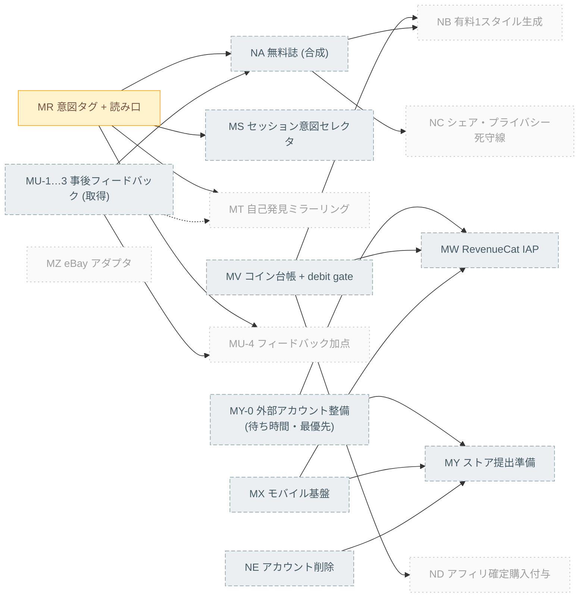

# Phase 3 Feature Matrix — gen-fashion

> **Source of truth:** [req-phase03.md](req-phase03.md)
> **Scope:** Differentiation (intent layer), monetization (coins + RevenueCat), mobile (Android/iOS), account deletion, second EC (eBay), and the monthly magazine image. Shipaton submission target.
> **Deadline:** **2026-09-30**. Work order and the fixed descope order are `req-phase03.md` §0.4 (ADL-051) and are reproduced below. Rows below the cut line are tracked but must not be started while anything above it is open.

---

## How to use this document

`req-phase03.md` defines *what* to build; this file tracks *how far each piece is*.

### Status legend

| Status | Meaning |
|---|---|
| ✅ Implemented | Fully implemented and verified as specified in `req-phase03.md`. |
| 🟡 In progress | Actively being developed, under review, or has an approved ExecPlan in flight. |
| ❌ Not yet implemented | No functionality exists. |

### Maintenance rules

1. This file must stay synced with `req-phase03.md`. A requirement added, removed, or re-scoped there updates the matching row here in the same change.
2. Whenever work on a tracked requirement starts, is planned via an ExecPlan, or is completed, update its status here.
3. **ExecPlan rule:** if an ExecPlan targets a row marked `❌ Not yet implemented`, that row **must** become `🟡 In progress` in the same change as the plan.
4. **One ExecPlan at a time.** A milestone gets its ExecPlan when it is picked up, not in advance. A milestone may need more than one ExecPlan; the per-milestone "ExecPlans" note below records the expected split.
5. `docs/architecture-overview.md` must be updated in the same change whenever a plan adds, removes, or re-wires a component, port/adapter, data store, or external service.

---

## Milestone overview

Fourteen milestones. Each is independently verifiable and leaves the repository
in a coherent state. **Priority** is the fixed work order from `req-phase03.md`
§0.4; work is dropped from the bottom of it, never from the middle.

| Priority | ID | Milestone | Depends on | Expected ExecPlans | Status |
|---|---|---|---|---|---|
| 1 | **MY-0** | External account provisioning (part of MY) | — | 0 (no code) | ❌ Not yet implemented |
| 2 | **MR** | Intent Tag Vocabulary, Capture & Ranking Read Path | — | 1 | 🟡 In progress |
| 3 | **MX** | Mobile Platform Bootstrap (Android/iOS) | — | 1–2 (bootstrap, then device parity fixes) | ❌ Not yet implemented |
| 4 | **MV** | Coin Wallet, Ledger & Debit Gate | — | 1–2 (domain+ledger, then gate wiring) | ❌ Not yet implemented |
| 4 | **MW** | RevenueCat IAP & Server-Verified Grant Webhook | MV, MX, MY-0 | 1–2 (webhook+ledger, then client paywall) | ❌ Not yet implemented |
| 5 | **NE** | Account Deletion & Data Retention | — | 1 | ❌ Not yet implemented |
| 6 | **MY** | Store Readiness & Internal-Track Distribution | MX, MY-0, NE | 1 | ❌ Not yet implemented |
| 7 | **MS** | Session-Level Intent Selector | MR | 1 | ❌ Not yet implemented |
| 8 | **MU** (1–3, 5) | In-App Post-Hoc Feedback — capture only | — | 1 | ❌ Not yet implemented |
| 9 | **NA** + NC-2/3/4 | Monthly Magazine — Free 4-Style Composite | MR, MU-1…3 | 1–2 (composition engine, then naming+cooldown) | ❌ Not yet implemented |
| — | *cut line* | | | | |
| 10 | **MU-4** | Feedback ranking boost | MU-1…3, MR | — | ❌ Not yet implemented |
| 11 | **MT** | Self-Discovery Mirroring (zero-LLM) | MR | 1 | ❌ Not yet implemented |
| 12 | **NC** (1, 5, 6) | Remaining share guardrails | NA | 1 | ❌ Not yet implemented |
| 13 | **NB** | Monthly Magazine — Paid Single Style | NA, MV | 1 | ❌ Not yet implemented |
| 14 | **MZ** | eBay Adapter & `search_ebay` Tool | — | 1 (+ spike first) | ❌ Not yet implemented |
| 15 | **ND** | Affiliate Confirmed-Purchase Coin Grants | MV (+ spike) | 1 (+ spike first) | ❌ Not yet implemented |

### Submission strategy and critical path

**One store submission carries mobile, coins, IAP, and deletion together**
(ADL-051). Consumable IAP products must be reviewed alongside a binary the first
time they are offered, so splitting them into a later build serialises two review
cycles inside a 7.5-week window. MS and NA ship in a follow-up build submitted
during the first review — review waiting time is the only slack in the phase and
is deliberately scheduled as implementation time.

**MY-0 is priority 1 because it is waiting time, not work.** Apple Developer
Program enrolment, Play Console registration, and store-side product approval
have multi-day to multi-week waits, and store-side products are a hidden
precondition of MW-6.

**MR is the highest-value implementation item** and is the one milestone that
proves the differentiation thesis. If its release condition (MR-6) fails, the
intent layer is decorative and MS, MT, and NA's affective layout all need
rethinking before they are built.

Solid edges are hard dependencies. **`MU → NA` became a hard dependency** in
ADL-049: the three-choice feedback answer is the valence axis the magazine
layout is built on. The remaining dotted edge (`MU ⇢ MT`) is a soft one — MT is
better with feedback data but does not require it. Greyed nodes are below the
cut line.

---

## MR — Intent Tag Vocabulary, Capture & Ranking Read Path

**Scope:** Add a closed intent vocabulary (`IntentTag`) and an affective mood vocabulary (`MoodTag`) with type-level sensitivity, capture them opt-in on closet items, index them, make them boost ranking in `hybrid_search`, and prove in the same milestone that turning the boost off changes candidate order. Reference: `req-phase03.md` §1, ADL-038, ADL-039, ADL-040.

> **Why this is one milestone and not two:** `ownership_status` is the precedent — it is written to Firestore and indexed into Elasticsearch and read by no ranking, search, or agent code (`req-phase03.md` §0.3). Shipping the write path without the read path produces another dead field. MR-4 and MR-6 are the release condition, not follow-up work.

> **ExecPlan (2026-08-06):** [20260806-mr-intent-tag-capture-and-ranking.md](plans/20260806-mr-intent-tag-capture-and-ranking.md). Authored 2026-08-06; MR-1…MR-7 → 🟡 In progress.

| ID | Feature | Status | Description | Req ref |
|---|---|---|---|---|
| MR-1 | Intent + mood vocabulary value objects | 🟡 In progress | `IntentTag` (5–7 closed values, **each carrying a static arousal coordinate**) and `MoodTag` (valence × arousal + `SHAREABLE`/`PRIVATE_ONLY` sensitivity) in a new `fastapi-service/app/domain/shared/affective.py` — **not** in `domain/closet/`, because MS-1 needs the same vocabulary on `UserPreference` in `domain/styling/` and the two bounded contexts do not import each other. Vocabulary is versioned so labels can change without migrating rows. Stored value is the enum name, never a display string. **Authored Japanese-first**; a weaker English label is compensated by the caption, not by changing the Japanese. Per-locale vocabularies are prohibited — the enum value means the same thing in every locale. | §1.1, ADL-038, ADL-040, ADL-049 |
| MR-2 | `ClothingItem.intent_tags` field + aggregate behavior | 🟡 In progress | Dedicated `intent_tags: List[IntentTag]` on the aggregate (`aggregates.py:16`) with a setter, **not** folded into the existing free-form `tags`. 0–3 values, opt-in; an item with none behaves exactly as today. | §1.2, ADL-039 |
| MR-3 | Capture UI + metadata API | 🟡 In progress | `UpdateClosetItemMetadata` and the closet `PATCH` route accept `intentTags`; Flutter closet edit dialog gains a localized multi-select, offered once at upload completion and skippable. No new Gemini call — intent is user input, not inference. | §1.2 |
| MR-4 | Elasticsearch mapping + indexing | 🟡 In progress | `intentTags` declared `keyword` in the canonical mapping (`fastapi-service/app/adapters/elasticsearch_embedding_repo.py`) alongside `tags`/`category`/`colors`; written on index and update. Existing documents without the field stay valid; no shared-closet reindex required. | §1.3 |
| MR-5 | `hybrid_search` intent boost clause | ✅ Implemented | Optional `intent` param on `hybrid_search` (`adk-agent-service/styling_app/adapters/elasticsearch.py:30`) adding a weighted `should` clause over `intentTags`, threaded through `search_closet`. **Boost, not filter** — unmatched items still return, ranked lower. Weight is config with a fixed default; tuning is out of scope. | §1.4 |
| MR-6 | On/off flag + ranking-change proof | ✅ Implemented | One config flag (`intent_boost_enabled`, `adk-agent-service/styling_app/config.py`) disables only the intent contribution. A checked-in script (`scripts/mr6_intent_ranking_proof.py`) **and** an automated test (`adk-agent-service/styling_app/tests/test_elasticsearch.py`) produce a log showing the same closet + same query returns a different candidate order boost-on vs boost-off. The fixture satisfies **all three**: (1) **sparse tagging** — only a subset of items carry intent tags; (2) **top-N membership changes**, not just tail order; (3) **two different intents produce two different orders**. Fixture is built on the **shared demo closet** so the same data serves the 90-second demo. **Release gate passed:** the order changed and top-N membership changed — independently reproduced against a live Elasticsearch, including a byte-identical idempotent re-run; the tag is not decorative. | §1.5, §1.6 |
| MR-7 | Tests + localization | 🟡 In progress | `fastapi-service` pytest, `adk-agent-service` pytest, `flutter analyze`/`flutter test` green; ja/en ARB keys for every vocabulary label and caption. **`adk-agent-service` pytest is done** (75 passed, including the new `test_elasticsearch.py`, independently reproduced). `fastapi-service` pytest, `flutter analyze`/`flutter test`, and the ja/en ARB keys are Milestone C's remaining scope. | §1.1, §1.6 |

**Exit criteria:** A user can tag a closet item with intent values in both languages and skip it entirely; the tag round-trips through Firestore and Elasticsearch; and a re-runnable verification proves the same closet and query produce a different candidate order with the boost on than off. If that last proof fails, the milestone closes by deleting the feature, not by shipping it.

---

## MS — Session-Level Intent Selector

**Scope:** Make intent a query-time signal the user picks explicitly before candidates are searched, so the reordering is a visible consequence of a user choice rather than inferred backend behavior. Reference: `req-phase03.md` §2, ADL-038.

> **Supersedes framing:** the 2026-08-01 discussion specified this selector with a fixed **occasion** list. ADL-038 keeps the mechanism and changes the axis to **intent**, because occasion is recoverable from garment attributes the system already extracts and would degenerate into a category alias.

| ID | Feature | Status | Description | Req ref |
|---|---|---|---|---|
| MS-1 | `UserPreference.intent` + `mood` | ❌ Not yet implemented | New optional fields on `UserPreference` (`fastapi-service/app/domain/styling/value_objects.py:33`), threaded through `POST /sessions/{id}/source` and `POST /sessions/{id}/assist`. Unset reproduces today's behavior exactly. The existing `occasion` field is left untouched and unused by this feature. | §2 |
| MS-2 | Flutter intent selector before search | ❌ Not yet implemented | Fixed intent options presented on the Coordinate screen **before** candidates are searched, each with a short caption. Optional, skippable, localized. | §2 |
| MS-3 | Intent shapes closet search | ❌ Not yet implemented | Selected intent is passed as the `intent` boost input to `search_closet` (MR-5). | §2 |
| MS-4 | Intent shapes EC query | ❌ Not yet implemented | Intent contributes descriptive terms to `search_rakuten` (and `search_ebay` if MZ has landed). Must not be blindly concatenated into every keyword variant — the MQ recall guardrail (`req-phase02.md` §3.7) applies unchanged, with a test proving it. | §2 |
| MS-5 | Tie-break pass + "why this" chips | ❌ Not yet implemented | Post-hoc tie-break over the ranked candidate list so reordering is visible in the proposal UI; each candidate shows a factual explanation chip ("you tagged this 強気でいたい"). **No praise, no personality claims** — template compliments are prohibited by product decision. | §2 |
| MS-6 | Demo-beat E2E | ❌ Not yet implemented | Browser/device E2E: with the closet unchanged, changing the selected intent and re-running the proposal visibly reorders candidates and changes the explanation chips. Must be observable in well under 90 seconds. | §2 |

**Exit criteria:** A user picks an intent before the agent searches; the same closet produces a visibly different candidate order and different explanation chips for two different intents, in both languages.

---

## MT — Self-Discovery Mirroring (Zero-LLM)

**Scope:** Return descriptive findings about the user's own data from day one, with zero model calls, to cover the two-to-three-week gap before accumulation pays off. Reference: `req-phase03.md` §3, ADL-047.

| ID | Feature | Status | Description | Req ref |
|---|---|---|---|---|
| MT-1 | Deterministic rule engine | ❌ Not yet implemented | Explicit rules over the requesting user's own Firestore/Elasticsearch records (counts, co-occurrence, distribution comparison). Each rule declares a minimum data threshold and yields nothing below it. **No LLM call anywhere on this path.** | §3.1, ADL-047 |
| MT-2 | Cold-start rule | ❌ Not yet implemented | At least one rule satisfiable from roughly ten items, so a user who has just filled their closet gets a finding the same day. | §3.1 |
| MT-3 | Precompute + cache | ❌ Not yet implemented | Findings are computed ahead of viewing and cached; the view path is a read. No aggregation runs on view. | §3.1 |
| MT-4 | Findings surface (Flutter) | ❌ Not yet implemented | Localized template rendering with slots — the stored finding is structured data, not a prose string. Free and unlimited. | §3.1 |
| MT-5 | Wording constraints test | ❌ Not yet implemented | Findings are descriptive and falsifiable; a test asserts templates carry no personality assertion, causation claim, or advice. | §3.1 |
| MT-6 | Zero-cost guard | ❌ Not yet implemented | An automated test asserts no model client is invoked on the generate-or-view path — the cost property is the feature, so it is tested, not assumed. | ADL-047 |

**Exit criteria:** A user with roughly ten closet items sees at least one true, reproducible finding about their own data on their first day; a test proves the path invokes no model.

---

## MU — In-App Post-Hoc Feedback

**Scope:** Collect the "how did it actually go" signal in-app on a completed session, closing the predicted-vs-actual loop without push infrastructure. Reference: `req-phase03.md` §4, ADL-049.

> **MU-1…MU-3 are above the cut line, MU-4 is below it.** ADL-049 makes the feedback answer the valence axis of the magazine layout, so *collecting* it is a hard dependency of NA. *Ranking on* it is optional and is the first thing dropped.

> **Why in-app and not an evening push:** the repository has FCM *configuration values* and zero token-registration, subscription, or send code. Same-day push collection is an independent workstream, deferred to phase 4 (`req-phase03.md` §0.2).

| ID | Feature | Status | Description | Req ref |
|---|---|---|---|---|
| MU-1 | `StyleSession.feedback` field | ❌ Not yet implemented | One field plus timestamp on the existing aggregate. No new aggregate, no new collection. **This field is the valence axis** NA-2 reads (ADL-049). | §4, ADL-049 |
| MU-2 | Feedback endpoint | ❌ Not yet implemented | `POST /sessions/{id}/feedback`, owner-scoped, idempotent (re-answering replaces). | §4 |
| MU-3 | Three-choice UI on completed result | ❌ Not yet implemented | One tap, optional, localized, on the completed Coordinate result panel. しっくり来た = positive / ふつう = neutral / 違った = negative. | §4 |
| MU-4 | Positive-feedback ranking boost | ❌ Not yet implemented — **below the cut line** | Items selected in positively-rated sessions get an additive `should` boost in later closet searches — same mechanism as MR-5, **not** a new ranking model. **Only if built:** all ranking weights move into one config block, the MR-6 proof runs in CI *after* this boost exists so a regression that buries the intent signal fails the build, and per-clause score contributions are written to the search log (not exposed in the API). Dropping this row is what keeps phase 3 to two ranking contributions instead of three. | §4 |
| MU-5 | Tests | ❌ Not yet implemented | Backend + Flutter tests, including that an unanswered session is unaffected and resolves to neutral valence. | §4 |

**Exit criteria:** A user answers the three-choice prompt on a completed session in one tap; the answer persists and demonstrably boosts those items in a subsequent search.

---

## MV — Coin Wallet, Ledger & Debit Gate

**Scope:** New `domain/billing/` bounded context with an append-only ledger, idempotent credit/debit, cost tiers, a one-time signup grant, and a debit gate in the candidate-approval use case. No IAP yet — purchased grants arrive in MW. Reference: `req-phase03.md` §5, ADL-041 (revised), ADL-048.

> **The debit commit point changed on 2026-08-07.** ADL-041 originally anchored it to the `PROPOSING → GENERATING` transition, on the premise that the transition was an atomic server-side gate in `fastapi-service`. It is not: `GENERATING` is written by `adk-agent-service` (`styling_app/server.py:151`) guarded only by an in-process monotonic counter, and `fastapi-service` never transitions to it (`aggregates.py:123` leaves the state at `PROPOSING`). The commit point is now `SelectCandidatesUseCase.execute` — same service as the ledger, one failure branch to compensate in. See `req-phase03.md` §0.3.

| ID | Feature | Status | Description | Req ref |
|---|---|---|---|---|
| MV-1 | `CoinWallet` + `CoinTransaction` ledger | ❌ Not yet implemented | New bounded context `fastapi-service/app/domain/billing/`. Balance is **derived from the append-only ledger**, not an independently-mutable number. | §5.1, ADL-041 |
| MV-2 | Idempotent credit/debit | ❌ Not yet implemented | `credit(ref_id, …)` / `debit(ref_id, …)` / `balance()`. Replaying a `ref_id` is a no-op returning the original result. Concurrent debit test. | §5.1 |
| MV-3 | Insufficient-balance error | ❌ Not yet implemented | Distinct domain error mapped to an HTTP status the client turns into a purchase prompt (mirroring the existing `DailyGenerationLimitExceeded` → 429 pattern). **Must be distinguishable from the daily cap refusal** — offering a purchase that does not resolve the refusal is worse than refusing plainly. | §5.1 |
| MV-4 | Debit gate in `SelectCandidatesUseCase` | ❌ Not yet implemented | Debit commits inside `fastapi-service/app/use_cases/styling/select_candidates.py` — after the `PROPOSING` check, selection validation, and `enforce_daily_generation_limit`, immediately before `agent_run.start_session_run` — keyed `ref_id = session_id`. **The existing `except` branch that calls `session.mark_error()` also writes a compensating credit** keyed `"{session_id}:refund"`. Tests: a session that fails validation is never charged; a dispatch failure leaves a debit and its compensating credit and a net-zero balance change; a replayed request leaves exactly one debit. | §5.1, ADL-041 |
| MV-5 | Cost tier table | ❌ Not yet implemented | One configuration table pricing actions by marginal cost class (generation ≫ analysis ≫ metadata). No literals scattered across call sites. | §5.1 |
| MV-6 | Runaway/abuse cap committed | ❌ Not yet implemented | Commit `max_daily_generations_per_user = 5` (already changed in the working tree, uncommitted). **Re-framed:** this is not a free-tier cap — once generation is debited it applies to paid runs too. Its job is bounding a bug, an automation loop, or a stolen account, where the coins are genuinely present and a balance check catches nothing. Free-by-design paths (MT, NA) still need their own separate caps. | §5.1 |
| MV-9 | One-time signup grant | ❌ Not yet implemented | New account receives a grant **sized at four generations**, written through the ledger as an ordinary credit keyed `ref_id = "signup:{user_id}"`. Four = the number of styles the free magazine composes from, so a fully-spent grant yields exactly one issue's material. Replaying the key credits nothing. **No recurring drip of any kind.** Without this row, a new user's first interaction is a paywall, contradicting §6.1's "paywall at the point of refusal". | §5.1, ADL-048 |
| MV-7 | Cached balance as derived state | ❌ Not yet implemented | A display balance document maintained for reads, treated as derived; the ledger wins on any disagreement, with a test proving it. | §5.1, ADL-041 |
| MV-8 | No free bypass path | ❌ Not yet implemented | Audit + test that every paid action routes through the debit gate — no remaining free generation or analysis entry point. **MV-9 is not an exception to this:** the signup grant is a ledger credit, so a granted generation is still debited and still auditable. What is prohibited is a code path that consumes without a ledger entry. | §5.1 |

**Exit criteria:** A new account starts with a four-generation grant; the wallet is debited exactly once per approved generation; a dispatch failure nets to zero through a compensating credit; a debit below zero is rejected with an error distinct from the daily cap; and the reported balance matches the ledger.

---

## MW — RevenueCat IAP & Server-Verified Grant Webhook

**Scope:** Consumable coin packs purchased through RevenueCat, granted only on a signature-verified webhook. Reference: `req-phase03.md` §6, ADL-042.

> **Depends on MV** (ledger) and **MX** (mobile platform, for a real purchase). The webhook half is independently testable without a device.

| ID | Feature | Status | Description | Req ref |
|---|---|---|---|---|
| MW-1 | Consumable coin-pack products | ❌ Not yet implemented | Coin packs configured in RevenueCat and the stores. **No subscription product** (`req-phase03.md` §0.2). | §6.1 |
| MW-2 | Signature-verified webhook endpoint | ❌ Not yet implemented | Signature checked **before** the body is parsed; invalid or missing signature rejected. This is the one part of MW that is not deferrable — an unsigned webhook lets anyone mint balance. | §6.1, ADL-042 |
| MW-3 | Idempotent grant on event id | ❌ Not yet implemented | Grant written through the MV ledger keyed by the RevenueCat event id, so redelivery cannot double-credit. | §6.1 |
| MW-4 | Client SDK is display-only | ❌ Not yet implemented | `Purchases.getCustomerInfo()` drives UI only. A test asserts no server path grants balance from client-reported state. | ADL-042 |
| MW-5 | Paywall at point of refusal | ❌ Not yet implemented | Purchase prompt appears when a debit fails for insufficient balance — not as an interstitial before the user has seen value. | §6.1 |
| MW-6 | Sandbox purchase E2E | ❌ Not yet implemented | Sandbox purchase on a device credits the wallet exactly once, verified in the ledger. | §6.1 |

**Exit criteria:** A sandbox purchase credits the wallet exactly once through a signature-verified webhook; a forged or replayed webhook credits nothing; a modified client cannot mint balance.

**Explicitly deferred to phase 4** (`req-phase03.md` ADL-042): missed-webhook reconciliation job, billing-retry state machine, independent double-verification against Apple/Google receipt APIs.

---

## MX — Mobile Platform Bootstrap (Android/iOS)

**Scope:** Add native platform targets to the existing Flutter package and get the current feature set running on real devices. Reference: `req-phase03.md` §7.1, ADL-044.

> **Start this early.** MX has no dependencies and MY (store review) sits behind it. It is the longest-lead item in the phase.

> **Naming note:** the package directory stays `flutter-web-app/` even though it will no longer be web-only. Renaming it touches CI, Dockerfiles, deploy scripts, and every doc path, and would be indistinguishable from real work in the diff (ADL-044).

| ID | Feature | Status | Description | Req ref |
|---|---|---|---|---|
| MX-1 | `android/` + `ios/` platform targets | ❌ Not yet implemented | Added to the existing `flutter-web-app/` package — one codebase, one widget tree, one API client for web and mobile. | §7.1, ADL-044 |
| MX-2 | Native Firebase Auth config | ❌ Not yet implemented | `google-services.json` / `GoogleService-Info.plist` from the existing Firebase project; sign-in works natively on both platforms. | §7.1 |
| MX-3 | Per-build API base URL | ❌ Not yet implemented | A device build targets local or production without code changes. | §7.1 |
| MX-4 | Dependency compatibility audit | ❌ Not yet implemented | Every existing dependency checked for mobile support; web-only usages replaced or guarded. | §7.1 |
| MX-5 | Device parity of existing flows | ❌ Not yet implemented | **Behavioral acceptance:** sign-in, closet upload, a Coordinate session through the selection gate to a generated image, and History all run on a physical Android device and an iOS device or simulator. | §7.1 |
| MX-6 | Responsive/touch fixes surfaced by device use | ❌ Not yet implemented | Layout and touch-target corrections found on real screens. Likely a second ExecPlan once MX-5 reveals the actual list. | §7.1 |

**Exit criteria:** The existing feature set runs end to end on a physical Android device and an iOS device or simulator from the same codebase that still builds and serves web.

---

## MY — Store Readiness & Internal-Track Distribution

**Scope:** Everything required to get builds in front of reviewers and testers. Reference: `req-phase03.md` §7.2.

| ID | Feature | Status | Description | Req ref |
|---|---|---|---|---|
| MY-0 | External account provisioning (**priority 1, day one**) | ❌ Not yet implemented | Apple Developer Program enrolment, Google Play Console registration, RevenueCat project, and registration + approval of the consumable coin-pack products in both stores. **No code.** Approval waits run days to weeks and no engineering effort shortens them, so the start date is the entire cost. This is also a hidden precondition of **MW-6** — a sandbox purchase cannot be tested until the store-side products exist — and of ADL-051's single-submission strategy. | §7.2 |
| MY-1 | Icons, launch screens, identifiers, versioning | ❌ Not yet implemented | App icons, launch screens, bundle identifiers, version/build numbering for both platforms. | §7.2 |
| MY-2 | Privacy manifest + data-collection disclosures | ❌ Not yet implemented | iOS privacy manifest and store data-collection disclosures **accurately stating affective data collection** (MR, MU) and its use, **plus the anonymized retention of coin-ledger rows after account deletion** (ADL-050). Inaccurate disclosure here is a rejection risk and a trust failure. | §7.2, §9.4, ADL-050 |
| MY-3 | Signing + release build pipeline | ❌ Not yet implemented | Release signing configured for both platforms; a release build is reproducible from a documented command. | §7.2 |
| MY-4 | TestFlight + Play internal track | ❌ Not yet implemented | A build is installable by a tester from each store's internal distribution channel. | §7.2 |

**Exit criteria:** A tester installs a signed build from TestFlight and from the Play internal track, and the store listings' data disclosures match what the app actually collects.

---

## NE — Account Deletion & Data Retention

**Scope:** An in-app account deletion path that actually removes the user's data from every store that holds it, with the coin ledger anonymized rather than deleted. Reference: `req-phase03.md` §11, ADL-050.

> **Why this is its own milestone and not a row inside MY:** it is a cross-cutting implementation over Firestore, R2, and Elasticsearch touching every aggregate this phase adds — not the same kind of work as icons, signing, and distribution. Buried in MY it would be estimated as a checkbox and started last, which is exactly when the rows added by MR, MU, and MV are easiest to miss. It is also a store-review blocker with no engineering workaround.

> **Current state:** the repository has item deletion (`closet_routes.py:76`) and session deletion (`session_routes.py:229`) and **no account deletion path at all**.

| ID | Feature | Status | Description | Req ref |
|---|---|---|---|---|
| NE-1 | In-app deletion entry point | ❌ Not yet implemented | Reachable without contacting support, with an explicit confirmation naming what is deleted. Both platforms and web. | §11.1 |
| NE-2 | Server-side cascade | ❌ Not yet implemented | Firestore documents under the user, R2 images, Elasticsearch documents. A deletion that clears Firestore but leaves the ES document is a privacy failure that also breaks search. | §11.1 |
| NE-3 | Idempotent + resumable | ❌ Not yet implemented | A partially failed deletion re-runs and converges. No half-deleted state that can still sign in. | §11.1 |
| NE-4 | Coverage test over user-scoped stores | ❌ Not yet implemented | An automated test enumerates the user-scoped collections/indices and **fails when a new one is added without being handled**, so a later milestone cannot silently introduce an uncovered store. This is what makes the affective fields (`intentTags`, session intent/mood, feedback) covered by construction. | §11.1 |
| NE-5 | Ledger anonymization | ❌ Not yet implemented | `CoinTransaction` rows retained with `user_id` replaced by an unlinkable surrogate, keeping amount, timestamp, reason, `ref_id` only. Excluded from the cascade by an **explicit rule**, not by omission. The append-only audit trail stays answerable ("was this user double-charged") while ceasing to be personal data. | §11.1, ADL-050 |

**Exit criteria:** A user deletes their account in-app; no Firestore document, R2 object, or Elasticsearch document referencing them remains; the coin ledger still balances but contains no identifier; and the coverage test fails if a new user-scoped store is added without handling.

---

## MZ — eBay Adapter & `search_ebay` Tool

**Scope:** A second EC source using a self-serve API, returning the same result shape as `search_rakuten`. Reference: `req-phase03.md` §8, ADL-043.

| ID | Feature | Status | Description | Req ref |
|---|---|---|---|---|
| MZ-0 | Feasibility spike (**precedes implementation**) | ❌ Not yet implemented | Check Browse API image quality and catalog consistency under New-condition + apparel-category filters against real responses. **If image quality is unusable for the generation path, eBay is dropped and this milestone closes as "verified not viable"** rather than shipping a degraded source. | §8.1 |
| MZ-1 | Shared `ProductResult` shape | ❌ Not yet implemented | id, title, price, currency, image_url, url, source. `search_rakuten`'s existing output is normalized to it **in the same milestone**, so there is never a period with two divergent shapes. No `EcommerceSearchPort` extraction yet (ADL-043). | §8.1, ADL-043 |
| MZ-2 | `adapters/ebay.py` | ❌ Not yet implemented | OAuth client-credentials Browse API client; credentials server-side only, matching the existing Rakuten constraint. | §8.1 |
| MZ-3 | `tools/search_ebay.py` | ❌ Not yet implemented | Mirrors `search_rakuten.py`'s registration pattern; New-condition + apparel-category filters applied at query time. | §8.1 |
| MZ-4 | Graceful degradation + tests | ❌ Not yet implemented | Unavailable eBay degrades the same way Rakuten does today rather than failing the session; tests use mocked responses. | §8.1 |

**Exit criteria:** An assisted session returns eBay candidates in the same shape as Rakuten candidates, they render in the existing candidate UI without source-specific branching, and an eBay outage degrades rather than fails the session — or the milestone closes at MZ-0 with a documented negative result.

---

## NA — Monthly Magazine: Free 4-Style Composite

**Scope:** One image, four styles, composed server-side from images the user already generated. Zero model calls. Reference: `req-phase03.md` §9.1, §9.3, ADL-045.

> **It is one image, not a booklet.** There are no issue-documents, pages, or binding concepts in the data model.

| ID | Feature | Status | Description | Req ref |
|---|---|---|---|---|
| NA-1 | Server-side composition engine | ❌ Not yet implemented | PIL composition over the user's existing completed `final_result` images. The existing `image_generation.generate` **cannot** be reused — its prompt explicitly forbids producing a collage — so this is a separate implementation regardless. | §9.1, ADL-045 |
| NA-2 | Affective-axis layout | ❌ Not yet implemented | The four styles are placed by valence and arousal, so the composition **is** a map of the month. This is what makes the free issue satisfy the same on/off test as MR-6: the arrangement is not recoverable from the images alone. Costs nothing extra. **Coordinate sources (ADL-049), in order:** arousal ← the static coordinate on the session's `IntentTag` (fallback: the selected garments' `intent_tags`, then low); valence ← the MU-1 feedback answer (fallback: neutral); an explicitly set session `MoodTag` overrides both. A month with nothing tagged or answered degrades to a plain grid instead of failing. | §9.1, ADL-049 |
| NA-3 | Server-enforced 30-day cooldown | ❌ Not yet implemented | 30 days **from the moment of generation**, not a calendar reset, enforced from a stored timestamp. A client-side check is not a cap. | §9.1 |
| NA-4 | First-issue design with thin material | ❌ Not yet implemented | A new user's first issue composes from whatever exists, including plain closet uploads, and looks intentional rather than empty. A first issue that looks broken means no second issue. | §9.1 |
| NA-5 | Naming engine | ❌ Not yet implemented | Titles derived from the user's own colors/season/intent/mood through templates, **user-editable**, independent of the image provider (ADL-046). Titles state facts — **no praise, no personality claims**. | §9.3 |
| NA-6 | Cooldown-expiry return trigger | ❌ Not yet implemented | The return trigger is the user's personal cooldown expiry, framed as the material-gathering window closing. **Time-based nagging is prohibited.** | §9.1 |
| NA-7 | Zero-generation guard | ❌ Not yet implemented | A test asserts the free path invokes no image-generation model. The cost property is the feature, so it is tested. | ADL-045 |

**Exit criteria:** A user generates a free issue containing four styles laid out by affective axis with editable fact-based titles; a second attempt within 30 days is refused server-side; and a test proves no generation model was called.

---

## NB — Monthly Magazine: Paid Single Style

**Scope:** One style, one high-quality generated image, purchased individually with coins. Reference: `req-phase03.md` §9.2, ADL-046.

| ID | Feature | Status | Description | Req ref |
|---|---|---|---|---|
| NB-1 | `ImageGenPort` + single Nano Banana adapter | ❌ Not yet implemented | Port defined with **one** adapter. OpenAI is explicitly not added (`req-phase03.md` §0.2). Adapter return values normalized to a storage key so bytes/URL/base64 differences stay inside the adapter. | ADL-046 |
| NB-2 | Sensitive-data transformation layer | ❌ Not yet implemented | One chokepoint in front of the port converting internal state into an **allowlisted abstract visual instruction**. Affective values, place, faces, and identifiers never cross into a provider payload. Direct adapter-to-provider calls bypassing this layer are prohibited; outbound payloads are audit-logged. **The existing try-on path (`adk-agent-service/styling_app/adapters/image_generation.py`) is routed through the same layer** — in phase 3 this is a routing change only, with the outbound payload byte-for-byte unchanged and a test asserting so. Excluding it would leave the product's highest-frequency outbound call as the one that is not audited. | ADL-046 |
| NB-3 | Per-style purchase + generation | ❌ Not yet implemented | One style, one image, one purchase. No issue-pack or bundle concept. | §9.2 |
| NB-4 | Style fixed before purchase | ❌ Not yet implemented | The style is confirmed **before** payment and presented as an editing action. **Generate → dislike → rebuy loops are prohibited** — the mechanic must not become a gacha. | §9.2 |
| NB-5 | Idempotent debit on put success | ❌ Not yet implemented | Debit commits on successful image put, keyed `ref_id = "{issue_id}:{style_no}"`. The magazine does not use the styling state machine, so this is its distinct commit point (ADL-041). | §9.2, ADL-041 |

**Exit criteria:** A user purchases one style, receives one full-quality image, and is charged exactly once — with a retried put producing no second charge.

---

## NC — Magazine Share Privacy Guardrails

**Scope:** Sharing a generated image publishes derived affective data to the outside world. This milestone makes that safe by construction. Reference: `req-phase03.md` §9.4, ADL-040.

> **Scoped to what is real.** Cross-user collective intelligence and its k-anonymity gate are *not* in this milestone: no cross-user recommendation feature exists to constrain (`req-phase03.md` §0.2). The type-level guarantee that makes it buildable later lands in MR-1.

> **Split by the cut line (§0.4).** **NC-2 / NC-3 / NC-4 ship with NA** — they are the minimum that makes an exported image safe. NC-1 / NC-5 / NC-6 are below the line. **If the NC-2/3/4 subset cannot be finished, NA ships with no export or share path at all** rather than an unguarded one: a magazine the user can only view is a smaller feature, a magazine that leaks `PRIVATE_ONLY` values is a broken promise.

| ID | Feature | Status | Description | Req ref |
|---|---|---|---|---|
| NC-1 | Default private + per-share consent | ❌ Not yet implemented | Nothing is public by default; sharing requires explicit consent **every time**, not once. | §9.4 |
| NC-2 | `PRIVATE_ONLY` structurally unreachable | ❌ Not yet implemented | The composition path accepts only `SHAREABLE` values, enforced by **parameter type at the boundary, not a runtime filter** — a forgotten call site is a type error, not a privacy incident. Test proves the sensitive type cannot be passed. | §9.4, ADL-040 |
| NC-3 | Place off by default | ❌ Not yet implemented | Place excluded from exports by default; if ever included, opt-in and limited to a category — never a place name or coordinates. | §9.4 |
| NC-4 | Export hygiene | ❌ Not yet implemented | Metadata stripped, no watermark, raw selfies never composited in. | §9.4 |
| NC-5 | No-fabrication constraint | ❌ Not yet implemented | The user's own garments and records are the subject. No substituted face, no garments the user does not have. An image the user does not recognize as theirs is one they will not share — which removes the feature's entire purpose. | §9.4 |
| NC-6 | External-provider disclosure | ❌ Not yet implemented | If image or garment data is sent to an external provider, the UI states it plainly, consistent with NB-2's audit log. | §9.4, ADL-046 |

**Exit criteria:** A shared export contains no negative-valence affective content, no place, and no file metadata; the sensitive type cannot reach the composition path even if a call site tries; and any external data transfer is disclosed in the UI.

---

## ND — Affiliate Confirmed-Purchase Coin Grants

**Scope:** Grant coins when an affiliate purchase is confirmed, funding the grant from real revenue. Reference: `req-phase03.md` §10.

> **Nothing else in phase 3 may depend on this.** If attribution turns out to be unavailable, in-app purchase (MW) remains the sole grant source and the rest of the phase is unaffected.

| ID | Feature | Status | Description | Req ref |
|---|---|---|---|---|
| ND-0 | Attribution feasibility spike (**precedes implementation**) | ❌ Not yet implemented | Determine whether confirmed-purchase attribution is actually available to this integration at this scale (Rakuten Affiliate reporting API or equivalent). **Unverified today.** If unavailable, the milestone closes as "not viable". | §10 |
| ND-1 | Confirmed-purchase grant path | ❌ Not yet implemented | Grant on **confirmed purchase**, never on click. A click-based grant is a free tap that mints model credit. | §10 |
| ND-2 | Non-negative margin constraint | ❌ Not yet implemented | `grant_value < affiliate_revenue` per transaction, enforced in code and covered by a test, so the path cannot run at a loss. | §10 |
| ND-3 | Idempotent grant | ❌ Not yet implemented | Keyed on the affiliate transaction id through the MV ledger; report re-ingestion cannot double-credit. | §10, ADL-041 |

**Exit criteria:** A confirmed affiliate purchase credits coins exactly once at a value below the revenue it earned — or the milestone closes at ND-0 with a documented negative result.

---

## Summary counts

| Status | Rows |
|---|---|
| ✅ Implemented | 2 (MR-5, MR-6) |
| 🟡 In progress | 5 (MR-1, MR-2, MR-3, MR-4, MR-7) |
| ❌ Not yet implemented | 75 |

**Total:** 82 rows across 14 milestones. Of these, **58 are above the cut line**
(MY-0, MR, MX, MV, MW, NE, MY-1…4, MS, MU-1…3/5, NA, NC-2/3/4) and **24 below**
(MU-4, MT, NC-1/5/6, NB, MZ, ND).

> The previous revision of this table stated "62 rows across 13 milestones"; the
> row count was wrong before this change as well as after it. Counted directly
> from the tables: 82.

---

## Open items carried from the source discussions

These require measurement or a product decision and are not blocked engineering
work. Full detail in `req-phase03.md` §12.

- Coin price points — needs measured Nano Banana and Gemini unit costs. The signup grant is fixed at four generations (MV-9); what a generation costs in coins, and what coins cost in money, is open.
- Daily cap values for the free-by-design paths (MT, NA), beyond the committed `max_daily_generations_per_user = 5` runaway cap.
- The exact intent vocabulary (MR-1 requires 5–7 values, each with a static arousal coordinate; which words is content). **The language policy is decided** — Japanese-first, captions close the English gap.
- The mirroring rule set and thresholds (MT-1/MT-2 define the constraints).
- First-issue composition design (NA-4).
- Whether anything beyond the cooldown-expiry trigger is needed for recall, under the standing prohibition on time-based nagging.
- Which of the three candidate beats leads the 90-second demo.

### Resolved since the source discussions (2026-08-07)

- **Debit commit point** — moved off the `PROPOSING → GENERATING` transition after verifying the transition is neither atomic nor in `fastapi-service` (ADL-041 revised).
- **Cold start under coins** — one-time four-generation signup grant (ADL-048, MV-9).
- **Where the affective axis comes from** — intent arousal × feedback valence (ADL-049).
- **Account deletion** — its own milestone with an anonymized ledger (ADL-050, NE).
- **Deadline and descope order** — 2026-09-30, one submission carrying mobile + coins + IAP + deletion (ADL-051, §0.4).
